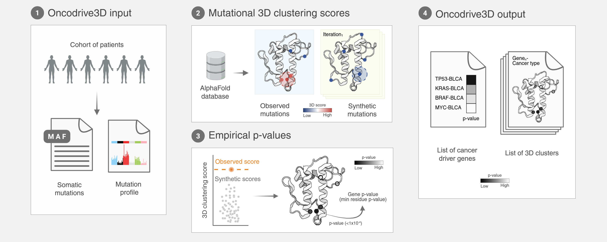

# Oncodrive3D

**Oncodrive3D** is a fast and accurate computational method designed to analyze patterns of somatic mutation across tumors, with the goal of identifying **three-dimensional (3D) clusters** of missense mutations and detecting genes under **positive selection**.

The method leverages **AlphaFold 2-predicted protein structures** and Predicted Aligned Error (PAE) to define residue contacts within the protein's 3D space. When available, it integrates **mutational profiles** to build an accurate background model of neutral mutagenesis. By applying a novel **rank-based statistical approach**, Oncodrive3D scores potential 3D clusters and computes empirical p-values.

[](https://www.gnu.org/licenses/agpl-3.0)
[](https://hub.docker.com/r/bbglab/oncodrive3d)
[](https://pypi.org/project/Oncodrive3D/)



## Requirements

Python 3.10+ is required. Some systems also need a C/C++ toolchain:

- With sudo privileges:

   ```bash
   sudo apt install build-essential
   ```

- On HPC clusters, [Conda](https://docs.conda.io/projects/conda/en/latest/user-guide/install/index.html) (or [Mamba](https://mamba.readthedocs.io/en/latest/)) is recommended:

   ```bash
   conda create -n o3d python=3.10.0
   conda activate o3d
   conda install -c conda-forge gxx gcc libxcrypt clang zlib
   ```

## Installation

- Install via PyPI:

   ```bash
   pip install oncodrive3d
   ```

- Alternatively, you can obtain the latest code from the repository and install it for development with pip:

   ```bash
   git clone https://github.com/bbglab/oncodrive3d.git
   cd oncodrive3d
   pip install -e .
   oncodrive3d --help
   ```

- Or you can use a modern build tool like [uv](https://github.com/astral-sh/uv):

   ```bash
   git clone https://github.com/bbglab/oncodrive3d.git
   cd oncodrive3d
   uv run oncodrive3d --help
   ```

## Building Datasets

This step builds the datasets necessary for Oncodrive3D to run the 3D clustering analysis. It is required once after installation or whenever you need to generate datasets for a different organism or apply a specific threshold to define amino acid contacts.

> [!WARNING]
> This step is time- and resource-intensive: it downloads and processes large amounts of structural data. Ensure adequate disk space, CPU, and a reliable internet connection (AlphaFold, Ensembl, Pfam, and other resources are fetched on demand).

<!-- -->

> [!WARNING]
> MANE builds force AlphaFold DB v4 structures (non-MANE builds default to v6). PAE files for v4 are no longer hosted after 2025, so MANE builds without `--custom_pae_dir` fall back to binary contact maps. To keep PAE-weighted probability maps, supply precomputed v4 PAE files via `--custom_pae_dir`.

<!-- -->

> [!NOTE]
> The first time that you run Oncodrive3D building dataset step with a given reference genome, it will download it from our servers. By default the downloaded datasets go to `~/.bgdata`. If you want to move these datasets to another folder you have to define the system environment variable `BGDATA_LOCAL` with an export command.

```text
Usage: oncodrive3d build-datasets [OPTIONS]

Examples:
  Basic build (human):
    oncodrive3d build-datasets -o <build_folder>

  Build with MANE Select transcripts:
    oncodrive3d build-datasets -o <build_folder> --mane

  Build mouse datasets:
    oncodrive3d build-datasets -o <build_folder> -s mouse
```

See `oncodrive3d build-datasets --help` for all options.

For more information on the output of this step, please refer to the [Building Datasets Output Documentation](docs/build_output.md).

> [!TIP]
> To extend MANE Select structural coverage beyond the AlphaFold MANE bundle, see the [MANE Preprocessing Toolkit](tools/preprocessing/README.md).

## Running 3D Clustering Analysis

See the [Input and Output Documentation](docs/run_input_output.md) for details on inputs and outputs.

### Input

- **Mutations file** (`required`): It can be either:
  - **<input_maf>**: A Mutation Annotation Format (MAF) file annotated with consequences (e.g., by using [Ensembl Variant Effect Predictor (VEP)](https://www.ensembl.org/info/docs/tools/vep/index.html)).
  - **<input_vep>**: The unfiltered output of VEP including annotations for all possible transcripts.

- **<mut_profile>** (`optional`): Dictionary including the normalized frequencies of mutations (*values*) in every possible trinucleotide context (*keys*), such as 'ACA>A', 'ACC>A', and so on.

> [!NOTE]
> Examples of the input files are available in the [Test Input Folder](test/input).  
Please refer to these examples to understand the expected format and structure of the input files.

<!-- -->

> [!NOTE]
> Oncodrive3D uses the mutational profile of the cohort to build an accurate background model. However, it’s not strictly required. If the mutational profile is not provided, the tool will use a simple uniform distribution as the background model for simulating mutations and scoring potential 3D clusters.

### Main Output

- **Gene-level output**: CSV file (`<cohort>.3d_clustering_genes.csv`) containing the results of the analysis at the gene level. Each row represents a gene, sorted from the most significant to the least significant based on the 3D clustering analysis. The table also includes genes that were not analyzed, with the reason for exclusion provided in the `status` column.
  
- **Residue-level output**: CSV file (`<cohort>.3d_clustering_pos.csv`) containing the results of the analysis at the level of mutated residues. Each row corresponds to a mutated position within a gene and includes detailed information for each potential mutational cluster.

### Usage

```text
Usage: oncodrive3d run [OPTIONS]

Examples:
  Basic run:
    oncodrive3d run -i <input_maf> -p <mut_profile> -d <build_folder> -C <cohort_name>

  Run using VEP output as input and MANE Select transcripts:
    oncodrive3d run -i <input_vep> -p <mut_profile> -d <build_folder> -C <cohort_name> \
                    --o3d_transcripts --use_input_symbols --mane
```

See `oncodrive3d run --help` for all options.

> [!WARNING]
> Human datasets built with the default settings pin canonical transcript metadata to the January 2024 Ensembl archive (release 111 / GENCODE v45). Annotate input variants with the same Ensembl/GENCODE release to avoid transcript-ID mismatches.

<!-- -->

> [!TIP]
> To maximize the number of matching transcripts between your input mutations and Oncodrive3D's structures, supply the unfiltered VEP output as input along with `--o3d_transcripts --use_input_symbols`.

### Handling Heterogeneous Sequencing Depth

Oncodrive3D can ingest **site-specific mutability tables** when a single mutational profile is not representative of the cohort (e.g., mutation calling performed on highly heterogeneous-depth datasets such as ultra depth **Duplex sequencing** panels commonly used in normal tissue analysis). Provide an indexed TSV describing per-site mutability together with a JSON config via `--mutability_config_path`. The run automatically switches from trinucleotide rates to per-position probabilities and tracks additional diagnostics (`Mut_zero_mut_prob`, `Pos_zero_mut_prob`, status `Mut_with_zero_prob/No_mutability`).  

Please see the [Mutability-aware runs guide](docs/mutability.md) for the expected file formats, config schema, and troubleshooting tips.

### Container Images

Oncodrive3D ships three image variants, each layered on top of the previous so you can pick the smallest one that covers your workflow:

| Variant | Tags | Approx size | Supported commands |
| --- | --- | --- | --- |
| Light | `bbglab/oncodrive3d:latest`, `:light`, `:<version>`, `:<version>-light` | ~490 MB | `run`, `plot` |
| ChimeraX | `bbglab/oncodrive3d:chimerax`, `:<version>-chimerax` | ~1.6 GB | `run`, `plot`, `chimerax-plot` |
| Full | `bbglab/oncodrive3d:full`, `:<version>-full` | ~4.7 GB | `run`, `plot`, `chimerax-plot`, `build-datasets`, `build-annotations` |

#### Docker

```bash
docker pull bbglab/oncodrive3d:latest
docker run --rm -v "$PWD":/data bbglab/oncodrive3d:latest \
    oncodrive3d run -i /data/<input_maf> -p /data/<mut_profile> \
                    -d /data/<build_folder> -C <cohort_name> -o /data/<output_dir>
```

#### Singularity

```bash
singularity pull oncodrive3d.sif docker://bbglab/oncodrive3d:latest
singularity exec oncodrive3d.sif oncodrive3d run \
    -i <input_maf> -p <mut_profile> -d <build_folder> -C <cohort_name>
```

> [!NOTE]
> Singularity only auto-binds `$HOME` and `$PWD`. If any input or output path lives outside those (e.g. `/data/...` on a cluster), bind that host path explicitly with `-B /path:/path` (e.g. `singularity exec -B /data:/data oncodrive3d.sif ...`).

### Testing

To verify that Oncodrive3D is installed and configured correctly, you can perform a test run using the provided test input files:

```bash
oncodrive3d run -d <build_folder> \
                -i ./test/input/maf/TCGA_WXS_ACC.in.maf \
                -p ./test/input/mut_profile/TCGA_WXS_ACC.sig.json \
                -o ./test/output/ -C TCGA_WXS_ACC
```

Check the output in the `test/output/` directory to ensure the analysis completes successfully.

## Building Annotations & Plotting

Oncodrive3D ships with an optional plotting pipeline: run `oncodrive3d build-annotations` once to cache structural/functional tracks, then use `oncodrive3d plot` and/or `chimerax-plot` to generate plots and tables that help interpret the clustering signal and distinguish real biology from artifacts.

See the [Annotation & plotting workflow](docs/annotations_plotting.md) for prerequisites, usage examples, and output descriptions.

## Parallel Processing on Multiple Cohorts

Oncodrive3D ships with a [Nextflow](https://www.nextflow.io/) pipeline for running multiple cohorts in parallel. See the [Oncodrive3D Pipeline documentation](oncodrive3d_pipeline/README.md) for setup, input layout, and options.

## License

Oncodrive3D is available to the general public subject to certain conditions described in its [LICENSE](LICENSE).

## Credits

Oncodrive3D was originally written by Stefano Pellegrini.

We thank the following people for their assistance in the development of this tool:

- [@koszulordie](https://github.com/koszulordie)
- [@FedericaBrando](https://github.com/FedericaBrando)
- [@FerriolCalvet](https://github.com/FerriolCalvet)
- [@odove](https://github.com/odove)

## Citation

If you use Oncodrive3D in your research, please cite:

> **Oncodrive3D: fast and accurate detection of structural clusters of somatic mutations under positive selection**
>
> Stefano Pellegrini, Olivia Dove-Estrella, Ferran Muiños, Nuria Lopez-Bigas, Abel Gonzalez-Perez
>
> *Nucleic Acids Research* 53(15) (2025) doi:[10.1093/nar/gkaf776](https://doi.org/10.1093/nar/gkaf776)
